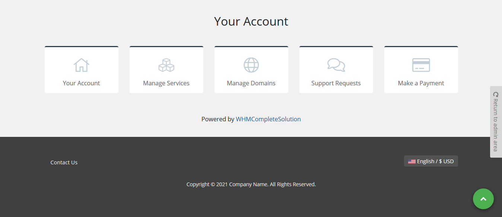

# Scroll to top WHMCS
Add **Scroll to top** button in WHMCS.

**Features**

- Working with WHMCS 7.x and 8.x
- Customizable color for background
- Without any template changes
- Working with any WHMCS templates

## Install

Download addon latest version form [latest release](https://github.com/farzadkhaledi/scrolltotop/releases/latest) and extract files, then upload **scrolltotop** folder to YOUR_WHMCS_ROOT/modules/addons folder.

Then login to your WHMCS admin area and in System Settings -> Addons Modules active **Scroll to top** addon.

## Customize Background Color

First Login to your WHMCS admin area and in top menu select Addons menu and then Scroll to top item, you can choose color for button background also hover color.

## Folders

<pre>
scrolltotop/
├── scrolltotop.php
├── hooks.php
├── index.php
├── whmcs.json
├── logo.png
├── assets/
    ├── icons/
    |   ├── index.php
    |   └── top-arrow.svg
    ├── material-scrolltop.css
    ├── index.php
    └── material-scrolltop.js
</pre>

## Credits

[https://github.com/bartholomej/material-scrolltop/](https://github.com/bartholomej/material-scrolltop/)

## License

All contents are licensed under the [MIT license].

[mit license]: LICENSE
